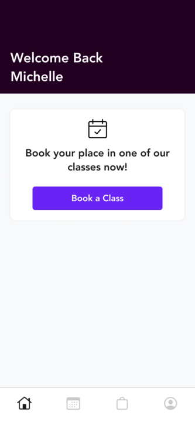

# xplor-iOS-challenge
iOS challenge for interviewing candidates

## This challenge will touch on the following concepts
* SwiftUI
* State Manegment 
* MVVM Architecture
* Json Serialization
* Protocol / Delegate Workflows
* Closures
* Unit Testing

## App Description 
The app contains a view template that should be completed based off the mock screen provided below. This view is only meant to be a visual aid. Candidates may add their own style and look. But the layout of each component should mimic the example

Each view is meant to demonstrate different levels SwiftUI experience (NOTE: There is no UIKit challenges in this project).
1. Basic Level - Cell view with text and interactable button
2. Intermediate - Full view layout with header
3. Advanced - Fully functional tab bar view

NOTE: these should be completed in order and only pass the basic level if time permites. This challenge should not exceed 1 hour in time, however it is not expected for candidates to complete all challenges presented. 

Once SwiftUI skills are shown, candidates should proceed to the next set of challenges. 

## Challenges included
- Fix broken `JsonModel` and successfully parse provide json files.
- Parse and return json via a closure.
- Parse and return json via a delegate method.
- Update UI based on both scenarios above (Closure/Delegate returns).
- Create a unit test for either of the two parsing methods. 
